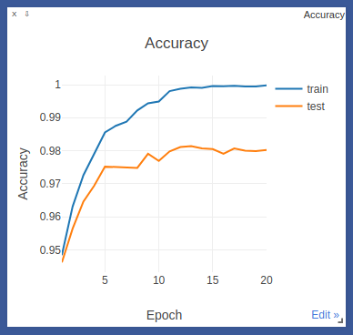

# Embedder SDR

The idea is to take advantage of binary sparse distributed representation (SDR) of embeddings in some domain such as computer vision.

The goal of this project is gradient-free optimization by sparse vectors association in an unsupervised fashion (refer to [Willshaw's model, 1969](https://redwood.berkeley.edu/wp-content/uploads/2018/08/willshaw1969.pdf)). While gradient-free optimization is not achieved yet, here I demonstrate how to construct meaningful (feature preserved, distributed) binary sparse vectors in deep learning with TripletLoss.

### Sparse Distributed Representation

Binary sparse distributed representations are formed with [k-winners-take-all](https://en.wikipedia.org/wiki/Winner-take-all_\(computing\)) activation function (kWTA), followed by a binarization. It replaces the last softmax layer in neural networks. kWTA layer implementation is [here](models/kwta.py).


### Ideas

Below is the list of ideas, taken from neuroscience and applied to deep learning. Each item is marked with the symbol :heavy_check_mark: (true), :negative_squared_cross_mark: (false), or :black_square_button: (to be investigated).   

:heavy_check_mark: kWTA can be used in deep neural networks, showing competitive results with traditional softmax cross-entropy loss.

:negative_squared_cross_mark: Models with kWTA can be trained from a randomly initialized point in parameters space. This is true only for simple datasets such as MNIST, CIFAR10.

:heavy_check_mark: Models with kWTA can be trained from a model, pretrained on the same dataset with conventional cross-entropy loss (or any other loss you might like). You replace the last layer with a fully-connected, followed by kWTA.

:negative_squared_cross_mark: All ReLU activation functions can be replaced with kWTA. This is not true. kWTA is not meant to replace ReLU. It's not meant to pass the gradients either. Doing so loses model's capability for training. kWTA should be used only in the last layer.

:negative_squared_cross_mark: Trained on same-same class examples with Contrastive loss, embedding representations collapse to a constant vector ([Yann LeCun, 2006](http://yann.lecun.com/exdb/publis/pdf/hadsell-chopra-lecun-06.pdf)). If we apply kWTA without changing the gradient flow and without telling what the class is, will it force the representation of each class to be unique?

:heavy_check_mark: [Synaptic scaling](https://en.wikipedia.org/wiki/Synaptic_scaling) helps. Synaptic scaling makes sure there are no dead neurons (which never participate in sensory coding) and weakens over-stimulated neurons (which are always active). Doing so increases the entropy of neural responses and thus the ability to preserve information about the stimuli.

:black_square_button: The latent space of binary SDR disentangles underlying factors of variation with simple operations from set theory: union, intersection, and difference. For example, an image of the dog `0010001000011` on the grass `0000101001010` would be a union of their representations - `0010101001011`. At the same time, a dog's SDR might consist of its underlying representations (fur, feet, tail, etc.). Bruno Olshausen gave a talk on this topic [here](https://youtu.be/QrvK3jPRc8k?t=3208).  


### Results

Below is the comparison between the traditional softmax and kWTA activation functions for `EmbedderSDR` shallow model, trained on MNIST dataset with the same optimizer and learning rate for both regimes. Cross-entropy loss is used for softmax, and triplet loss - for kWTA.

```
EmbedderSDR(
  (conv): Conv2d(1, 3, kernel_size=(3, 3), stride=(1, 1), bias=False)
  (bn): BatchNorm2d(3, eps=1e-05, momentum=0.1, affine=True, track_running_stats=True)
  (relu1): ReLU(inplace)
  (maxpool): MaxPool2d(kernel_size=3, stride=3, padding=0, dilation=1, ceil_mode=False)
  (fc1): Linear(in_features=192, out_features=128, bias=False)
  (relu2): ReLU(inplace)
  (fc2): Linear(in_features=128, out_features=10, bias=False)
)
```

Traditional softmax:



K-winners-take-all:


On the right plot, kWTA's output forms binary sparse distributed representation, averaged across samples for each class (label). Some neurons may respond to different patterns, but their ensemble activation uniquely encodes a stimulus (distributed coding).

For more results, go to [http://85.217.171.57:8097/](http://85.217.171.57:8097/). Give your browser a few minutes to parse the json data. Choose the environment with `TrainerGradKWTA` - this is the trainer with kWTA activation function.

### Articles, implemented and used in this work

1. Fong, R. C., & Vedaldi, A. (2017). Interpretable explanations of black boxes by meaningful perturbation.
    * Paper: https://arxiv.org/abs/1704.03296
    * Used in: `trainer/mask.py`

2. Belghazi, M. I., Baratin, A., Rajeswar, S., Ozair, S., Bengio, Y., Courville, A., & Hjelm, R. D. (2018). Mine: mutual information neural estimation.
    * Paper: https://arxiv.org/abs/1801.04062
    * Used in: `monitor/mutual_info/neural_estimation.py`

3. Kraskov, A., Stögbauer, H., & Grassberger, P. (2004). Estimating mutual information.
    * Paper: https://arxiv.org/abs/1208.4475
    * Used in: `monitor/mutual_info/npeet.py`
    * Original source code: https://github.com/gregversteeg/NPEET

4. Wollstadt, P., Lizier, J. T., Vicente, R., Finn, C., Martínez-Zarzuela, M., Mediano, P., ... & Wibral, M. (2018). IDTxl: The Information Dynamics Toolkit xl: a Python package for the efficient analysis of multivariate information dynamics in networks.
    * Paper: https://arxiv.org/abs/1807.10459
    * Used in `monitor/mutual_info/idtxl_jidt.py`
    * Original source code: https://github.com/pwollstadt/IDTxl

5. Ince, R. A., Giordano, B. L., Kayser, C., Rousselet, G. A., Gross, J., & Schyns, P. G. (2017). A statistical framework for neuroimaging data analysis based on mutual information estimated via a gaussian copula. Human brain mapping, 38(3), 1541-1573.
    * Paper: http://dx.doi.org/10.1002/hbm.23471
    * Used in `monitor/mutual_info/gcmi.py`
    * Original source code: https://github.com/robince/gcmi
